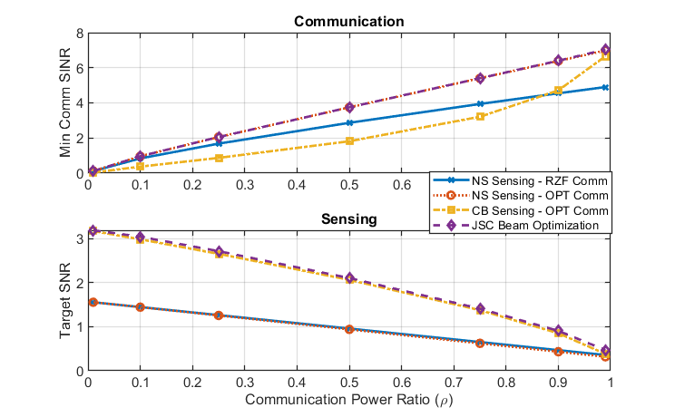
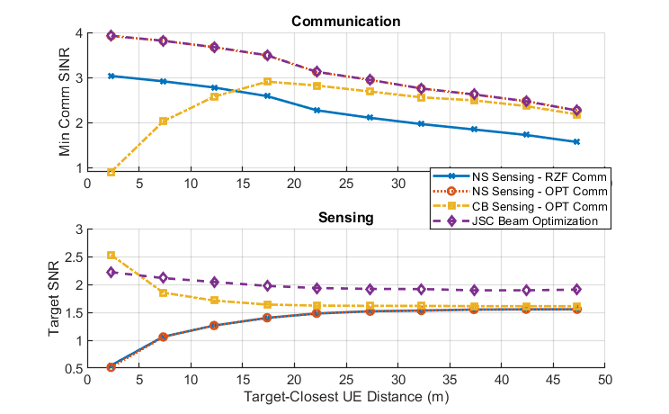

## Cell-Free ISAC MIMO Systems: Joint Sensing and Communication Beamforming using WOA-GWO

A MATLAB implementation for Cell-Free Integrated Sensing and Communication (ISAC) MIMO beamforming optimization using the hybrid Whale Optimization Algorithm - Grey Wolf Optimizer (WOA-GWO).

### Overview

This project implements a metaheuristic optimization approach for joint sensing and communication beamforming in cell-free ISAC MIMO systems. The implementation replaces traditional convex optimization methods (SDP, SOCP) with a hybrid WOA-GWO algorithm, eliminating the need for CVX toolbox.

### Algorithms

#### Whale Optimization Algorithm (WOA)
WOA is a nature-inspired metaheuristic algorithm that mimics the social behavior of humpback whales. The algorithm uses three main operators:
- **Encircling prey**: Whales encircle the prey (best solution found so far)
- **Bubble-net attacking (exploitation)**: Spiral updating position to simulate bubble-net attacking behavior
- **Search for prey (exploration)**: Random search to explore the solution space

#### Grey Wolf Optimizer (GWO)
GWO is inspired by the leadership hierarchy and hunting mechanism of grey wolves:
- **Alpha (α)**: Best solution - leads the hunt
- **Beta (β)**: Second-best solution - assists alpha
- **Delta (δ)**: Third-best solution - follows alpha and beta
- **Omega (ω)**: Remaining solutions - follow the leaders

#### Hybrid WOA-GWO Strategy
The hybrid approach combines the strengths of both algorithms:
- **Phase 1 (60% iterations)**: WOA exploration for global search
- **Phase 2 (40% iterations)**: GWO exploitation for local refinement
- This combination achieves a balance between exploration and exploitation

### Reproducing the Results

* The simulation parameters can be set in `sim_params.m` file.

* **No CVX required!** Simply run `run.m` to generate the simulation results using the WOA-GWO optimizer.

(This step may be skipped since the output data files are pre-generated and already available. If skipped, add the subfolders to the MATLAB path before the next steps.)

* Run `plots/plot_results_power.m` to regenerate Figure 3 (power ratio vs performance) of the paper.



* Run `plots/plot_results_dist.m` to regenerate Figure 4 (min. distance vs performance) of the paper.



### WOA-GWO Parameters

The optimization parameters can be configured in `sim_params.m`:
```matlab
params.woa_gwo.n_whales = 30;              % Number of whales/agents
params.woa_gwo.n_wolves = 20;              % Number of wolves
params.woa_gwo.max_iter = 100;             % Maximum iterations
params.woa_gwo.lb = -10;                   % Lower bound
params.woa_gwo.ub = 10;                    % Upper bound
params.woa_gwo.sensing_weight = 0.01;      % Weight for sensing SNR in fitness
params.woa_gwo.penalty_factor = 100;       % Penalty for constraint violations
params.woa_gwo.feasibility_tolerance = 0.9; % Tolerance for feasibility check
```

### Project Structure

```
├── optimization/
│   ├── WOA_GWO_optimizer.m      # Main WOA-GWO hybrid optimizer
│   ├── opt_comm_SOCP_vec.m      # Legacy SOCP optimizer (unused)
│   ├── bisection_SINR.m         # Legacy bisection method (unused)
│   ├── opt_jsc_SDP.m            # Legacy SDP optimizer (unused)
│   └── SDP_beam_extraction.m    # Legacy beam extraction (unused)
├── beamforming/                  # Beamforming utility functions
├── channel/                      # Channel generation functions
├── utils/                        # Utility functions (SINR, SNR computation)
├── plots/                        # Result plotting scripts
├── simulation.m                  # Main simulation function
├── sim_params.m                  # Simulation parameters
└── run.m                         # Main entry point
```

### Abstract

*This project extends the work on cell-free integrated sensing and communication (ISAC) MIMO systems by implementing a metaheuristic optimization approach. The original paper uses convex optimization (SDP/SOCP) which requires the CVX toolbox. This implementation replaces those methods with a hybrid Whale Optimization Algorithm - Grey Wolf Optimizer (WOA-GWO) approach, making the code more accessible and eliminating external dependencies.*

*The system considers distributed MIMO access points jointly serving communication users and sensing targets. The WOA-GWO optimizer handles:*
- *Communication-prioritized sensing beamforming*
- *Sensing-prioritized communication beamforming*  
- *Joint sensing and communication (JSC) beamforming design*

### References

1. **Original Paper**: U. Demirhan and A. Alkhateeb, "Cell-free ISAC MIMO systems: Joint sensing and communication beamforming." arXiv preprint arXiv:2301.11328, 2023.

2. **Whale Optimization Algorithm**: S. Mirjalili and A. Lewis, "The Whale Optimization Algorithm," Advances in Engineering Software, vol. 95, pp. 51-67, 2016.

3. **Grey Wolf Optimizer**: S. Mirjalili, S. M. Mirjalili, and A. Lewis, "Grey Wolf Optimizer," Advances in Engineering Software, vol. 69, pp. 46-61, 2014.

### License

<a rel="license" href="http://creativecommons.org/licenses/by-nc-sa/4.0/"></a><br />This code package is licensed under a [Creative Commons Attribution-NonCommercial-ShareAlike 4.0 International License](https://creativecommons.org/licenses/by-nc-sa/4.0/). 

If you in any way use this code for research that results in publications, please cite:

> U. Demirhan and A. Alkhateeb, "Cell-free ISAC MIMO systems: Joint sensing and communication beamforming." arXiv preprint arXiv:2301.11328, 2023.
